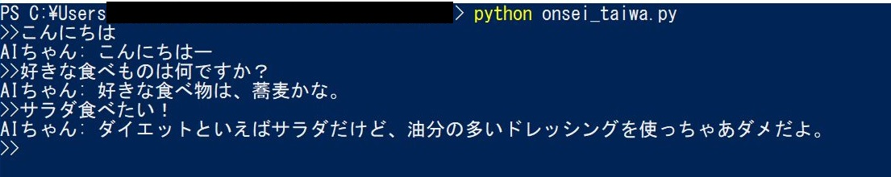

docomoのAPIを使った音声対話プログラム
====

NTT docomoの[自然対話API](https://dev.smt.docomo.ne.jp/?p=docs.api.page&api_name=natural_dialogue&p_name=api_usage_scenario)と[音声合成API](https://dev.smt.docomo.ne.jp/?p=docs.api.page&api_name=text_to_speech&p_name=api_usage_scenario)を使ったPythonスクリプトです。

## Description
コマンドライン上にメッセージを入力してエンターを押すと、AIからの返事が音声と共に届きます。  
pydubを使ってaacを再生しており、同一フォルダ上に ffmpeg.exe 等を用意する必要があります。

## Demo

## Requirement
- Python3 or more

## Usage
`python3 onsei_taiwa.py`  

## Author

[nekunet](https://github.com/nekunet)
